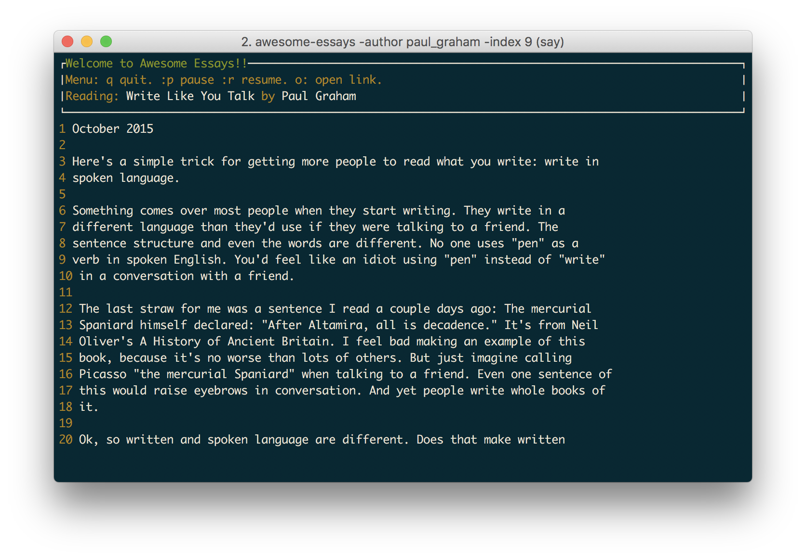

# awesome-startup-essays

A simple tool I built for listening to curated collection of startup essays. Use's OSX's default text-to-speech tool.

**IMPORTANT**: Works on OSX only. I've plans to support platforms in the future.



# Install

```
git clone https://github.com/hemantasapkota/awesome-startup-essays
go build .
```

# Usage

```
./awesome-startup-essays -fie paul_graham/airbnb.txt
```
# Controls
```
q: Quit
p: Pause
r: Resume
o: Open link to the essay
```
